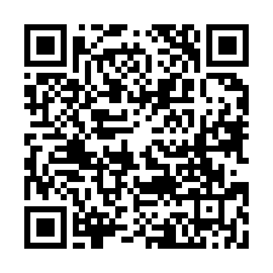

# Guardio: Your Private, End-to-End Encrypted Cloud



**Guardio is a full-stack, security-first web application that gives you total control over your digital life. It combines an encrypted file manager and a secure password vault, all protected by robust Multi-Factor Authentication (MFA).**

---

## ✨ Features

Guardio is built on the principle of zero-knowledge privacy. We can't see your data, and no one else can either.

* 🔐 **Multi-Factor Authentication (MFA):** Secure your account beyond just a password. Guardio integrates with standard authenticator apps (like Google Authenticator or Authy) to provide time-based one-time password (TOTP) verification at login.

* 📂 **Encrypted File Manager:**
    * **Upload & Organize:** Upload your sensitive documents, photos, and files. Organize them with a simple and intuitive folder structure.
    * **End-to-End Encryption:** Every file is encrypted on the server with the powerful Fernet (AES-128) symmetric encryption before it's ever written to disk. Your files are stored as unreadable ciphertext.
    * **Secure Downloads:** Files are decrypted in memory only when you request them for download, ensuring your plain data is never exposed on the server.

* 🔑 **Encrypted Password Manager:**
    * **Secure Vault:** Store your website logins, passwords, and usernames in a centralized, secure vault.
    * **Zero-Knowledge:** Just like your files, your passwords are encrypted before being saved. The "Reveal" function decrypts them on-the-fly, only for you.

* 🛡️ **Admin Oversight (RBAC):**
    * Admin dashboard with summary stats, backup export, security posture
    * User management (edit role/email/username, delete) with audit logging
    * Configurable limits via Admin Settings (upload size, allowed extensions, rate limits)

### Audit Blockchain

All audit events are stored in a single, append-only blockchain with SHA-256 linking between blocks. Users can:

- Per-user visibility: users see only their own actions + genesis; admin sees all
- Export JSON (user scope or full scope for admin)
- Save a personal snapshot marker indicating the latest block they have acknowledged
 - Visual chain UI with linked blocks and expandable metadata
 - Integrity badge (Verified/Warning) by recomputing chained hashes

Implementation details:

- Models: `AuditBlock`, `UserAuditMarker`
- Helper: `append_audit(action, metadata, actor_user_id)` computes and stores chained hashes
- Genesis block is created automatically on first run
    * The first user to register automatically becomes the **Admin**.
    * The admin panel provides a high-level overview of all registered users and allows the admin to see *what* is being stored (e.g., filenames, password entry websites) but not the encrypted content itself, respecting user privacy while allowing for system management.

---

## 🚀 Tech Stack

Guardio is built with a focus on security, reliability, and modern development practices.

| Category      | Technology                               | Purpose                                          |
|---------------|------------------------------------------|--------------------------------------------------|
| **Backend** | Python, Flask                            | Core application logic and routing.              |
| **Database** | SQLite via Flask-SQLAlchemy              | Data persistence for users, files, and passwords.|
| **Security** | Flask-Bcrypt, `cryptography`, `pyotp`    | Password hashing, data encryption, and MFA.      |
| **Frontend** | HTML, CSS (with Jinja2 Templating)       | User interface and design (light/dark themes).   |
| **Rate limiting** | Simple in-memory limiter             | Per-minute limits by user/IP.                    |

---

## ⚙️ Getting Started

Follow these steps to set up and run a local instance of Guardio.

### 1. Prerequisites
* Python 3.8+
* A virtual environment tool (`venv`)

### 2. Setup Instructions

1.  **Clone & Enter:**
    ```bash
    git clone [https://your-repo-url.git](https://your-repo-url.git)
    cd guardio
    ```

2.  **Activate Virtual Environment:**
    ```bash
    python3 -m venv venv
    source venv/bin/activate
    ```

3.  **Install Dependencies:**
    ```bash
    pip install -r requirements.txt
    ```

4.  **Configure Environment:**
    * Create a `.env` file in the root directory.
    * Generate a secure encryption key:
        ```bash
        python -c "from cryptography.fernet import Fernet; print(Fernet.generate_key().decode())"
        ```
    * Add your keys to the `.env` file:
        ```
        SECRET_KEY='a_strong_random_string_for_flask_sessions'
        ENCRYPTION_KEY='your_generated_key_from_the_command_above'
        GEMINI_API_KEY='your_gemini_api_key_here'
        # Optional runtime limits (overridden by Admin Settings if present)
        MAX_UPLOAD_MB=10
        ALLOWED_EXTENSIONS='txt,pdf,png,jpg,jpeg,gif'
        RATE_LIMIT_PER_MIN=60
        ```

5.  **Initialize the Database:**
    * This creates the `mfa_app.db` file with all necessary tables. **Run this only once.**
    ```bash
    python -c "from app import app, db; app.app_context().push(); db.create_all()"
    ```

6.  **Run the App:**
    ```bash
    flask run
    ```
    Guardio is now running at `http://127.0.0.1:5000`. The first account you create will be the admin.

7.  **Admin Settings (optional):**
    - Log in as admin, open Admin Panel → Open Settings.
    - Adjust upload size, allowed file extensions, and rate limiting.

8.  **Themes:**
    - Toggle dark/light theme from the header (persists in localStorage).

---

## 🧪 Testing

### Run tests

```bash
pip install -r requirements.txt
pip install pytest
pytest -q
```

### Manual test guide

1. Register users and verify MFA
2. Upload/download/delete files (exercise limits and disallowed extensions)
3. Add/reveal/delete password entries
4. Admin: edit/delete users, backup, and change settings
5. Audit: confirm per-user visibility, export scope, and integrity badge

---

## 🔐 Security Highlights

- MFA (TOTP), bcrypt password hashing, Fernet encryption
- CSRF protection and per-minute rate limiting
- Blockchain-inspired audit with SHA-256 linking and verification
- Role-based access and scoped audit visibility

## 💼 Business Value

- Tamper-evident compliance trail
- Zero-knowledge encrypted storage and vault
- Admin oversight with configurable guardrails

## 📚 Learning Outcomes

- Secure authentication, RBAC, CSRF in Flask
- Tamper-evident audit design and verification
- Theming (light/dark), toasts, and UX patterns
- Testing/CI foundations

